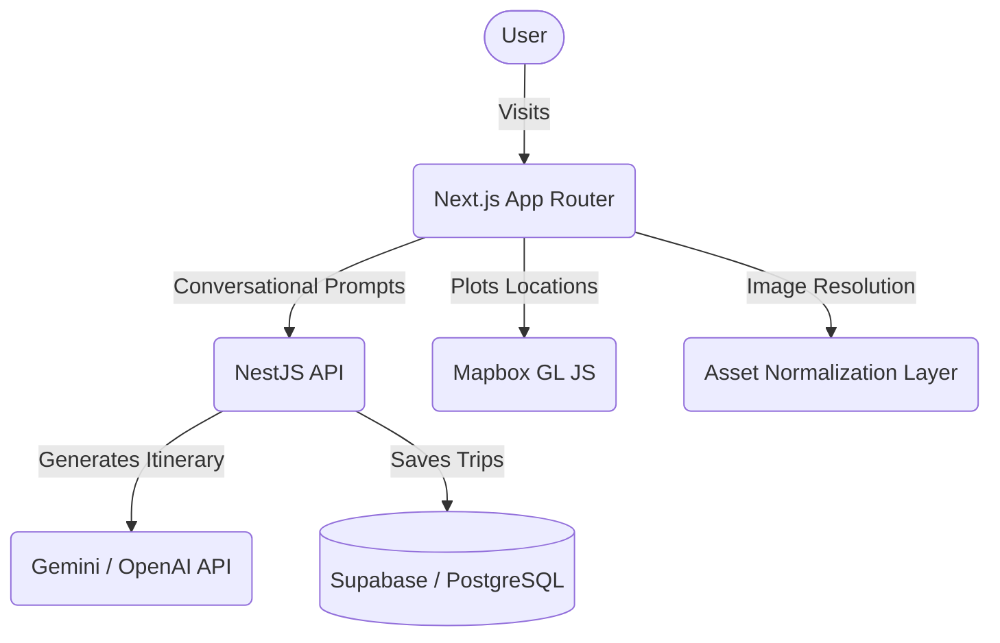

<div align="center">
  

  # 🌍 VoyageAI
  **Your Intelligent, End-to-End Travel Operating System**

  <p align="center">
    
    
    
    
    
  </p>
</div>

---

**VoyageAI** is a premium, AI-powered Travel Operating System designed to act as your personal, highly intelligent travel consultant. It automatically transforms natural language requests into perfectly orchestrated, map-integrated itineraries with precise budgets, dynamic routes, and smart fallbacks.

## 📑 Table of Contents
- [✨ Key Features](#-key-features)
- [🏗 Architecture & Tech Stack](#-architecture--tech-stack)
- [🚀 Quick Start Guide](#-quick-start-guide)
- [📂 Monorepo Structure](#-monorepo-structure)
- [🧠 AI & Image Normalization](#-ai--image-normalization)
- [🤝 Contributing](#-contributing)
- [📄 License](#-license)

---

## ✨ Key Features

- 💬 **Conversational Trip Builder:** Chat with the AI or use smart chips to dynamically set Destination, Budget, Travelers, and Vibe without restarting.
- 🗺️ **Interactive Mapping:** Powered by Mapbox GL, featuring real-time itinerary coordinate plotting and synchronized hover states between map and sidebar.
- 📅 **Intelligent Itinerary Generation:** Generates multi-day, componentized schedules spanning sightseeing, transit, hotels, and dining.
- 🛡️ **Robust Error Recovery:** Fully resilient architecture that gracefully recovers from AI hallucinations, missing coordinates, or incomplete pricing data.
- 🖼️ **Asset Normalization Layer:** Automatic, central resolution of landmark names into verified high-quality imagery via an internal catalog & Unsplash fallbacks.
- ⚡ **Defensive UI Rendering:** Zero runtime crashes. State-of-the-art fallback logic ensures the application degrades elegantly instead of breaking.

---

## 🏗 Architecture & Tech Stack

This project is built as a **PNPM Monorepo**, ensuring seamless dependency management and cohesive development between the frontend and backend.



- **Frontend (`apps/frontend`):** Next.js (App Router), React Server Components, Tailwind CSS, Framer Motion.
- **Backend (`apps/backend`):** NestJS, Prisma ORM, Supabase Auth, Google Gemini API Orchestration.

---

## 🚀 Quick Start Guide

### Prerequisites
Make sure you have the following installed:
- [Node.js](https://nodejs.org/) (v18 or higher)
- [PNPM](https://pnpm.io/) (`npm install -g pnpm`)

### 1. Clone the repository
```bash
git clone https://github.com/Nithish-Bharathwaj-N/Voyage-AI.git
cd Voyage-AI
```

### 2. Install dependencies
From the root of the workspace, run:
```bash
pnpm install
```

### 3. Configure Environment Variables
You need to set up environment variables for both the frontend and backend.
Look at `.env.example` in the root, and distribute the keys into:
- **`apps/frontend/.env.local`** (Next.js public keys, API URL)
- **`apps/backend/.env`** (Database URLs, Gemini API keys, Secret JWTs)

### 4. Start the Application
Run the global dev script to spin up both servers concurrently:
```bash
pnpm dev
```
- **Frontend:** [http://localhost:3000](http://localhost:3000)
- **Backend API:** [http://localhost:3001](http://localhost:3001)

---

## 📂 Monorepo Structure

```text
Voyage-AI/
├── apps/
│   ├── frontend/        # Next.js Application (UI, Maps, State)
│   └── backend/         # NestJS API Server (Data pipelines, Prompts)
├── pnpm-workspace.yaml  # Workspace configuration
├── package.json         # Root scripts (dev, build, lint)
├── .gitignore           # Unified ignore rules
└── README.md            # This file
```

---

## 🧠 AI & Image Normalization

VoyageAI features a custom **Asset Normalization Layer**. When the AI generates a trip, it often hallucinates image URLs or returns generic text like `"Eiffel Tower"`. 

To prevent UI crashes and ensure a premium feel, VoyageAI intercepts the AI payload and routes it through a strict normalization engine:
1. **URL Validation:** Confirms protocol integrity.
2. **Internal Registry:** Matches text against a high-quality curated dictionary of top global destinations (Tokyo, Paris, Leh, etc.).
3. **Fallback Chain:** Drops down to Unsplash category searches and finally a generic placeholder if all else fails. 

**Result:** The UI never receives a broken `src`, guaranteeing 100% uptime.

---

## 🤝 Contributing

Contributions are always welcome! 
1. Fork the Project
2. Create your Feature Branch (`git checkout -b feature/AmazingFeature`)
3. Commit your Changes (`git commit -m 'Add some AmazingFeature'`)
4. Push to the Branch (`git push origin feature/AmazingFeature`)
5. Open a Pull Request

## 📄 License

This project is licensed under the [MIT License](LICENSE).
