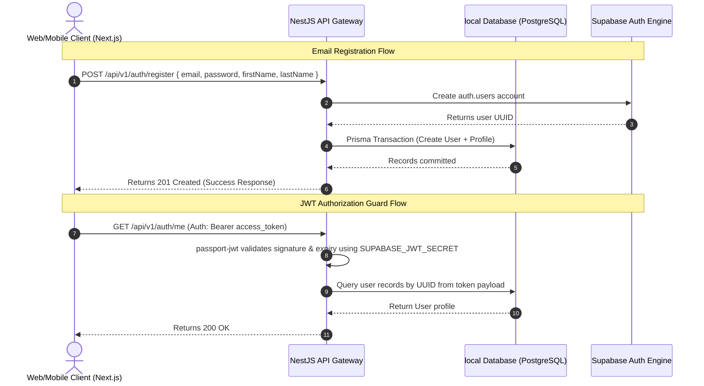

# VoyageAI Authentication Documentation

This document describes the architectural flow, component tree, endpoints, and security guardrails of VoyageAI's Authentication Module.

---

## 1. Authentication Architecture

VoyageAI delegates credential hashing, storage, multi-factor authentication (MFA), and OAuth2 federated provider flows (Google) to **Supabase Auth**. Our NestJS backend serves as a **Resource Server** that verifies signatures and validates user tokens locally.



---

## 2. API Endpoints Catalog

Every endpoint is versioned and prefixed under `/api/v1/`.

### 2.1. `POST /api/v1/auth/register`
- **Description**: Creates a new user identity in Supabase Auth and inserts matched profile records inside the local `users` and `profiles` database tables in a single transaction.
- **Request Body**:
  ```json
  {
    "email": "traveler@example.com",
    "password": "Password123!",
    "firstName": "John",
    "lastName": "Doe"
  }
  ```
- **Response Example**:
  ```json
  {
    "success": true,
    "message": "Operation completed successfully",
    "data": {
      "user": {
        "id": "d3b07384-d113-4956-a320-13e2f5e3f402",
        "email": "traveler@example.com",
        "firstName": "John",
        "lastName": "Doe"
      }
    }
  }
  ```

### 2.2. `POST /api/v1/auth/login`
- **Description**: Authenticates users with their email and password credentials using the Supabase Client API.
- **Request Body**:
  ```json
  {
    "email": "traveler@example.com",
    "password": "Password123!"
  }
  ```
- **Response Example**:
  ```json
  {
    "success": true,
    "message": "Operation completed successfully",
    "data": {
      "accessToken": "eyJhbGciOiJIUzI1NiIsInR5cCI6IkpXVCJ9...",
      "refreshToken": "d7a987d6a78d...",
      "expiresIn": 3600,
      "user": {
        "id": "d3b07384-d113-4956-a320-13e2f5e3f402",
        "email": "traveler@example.com"
      }
    }
  }
  ```

### 2.3. `POST /api/v1/auth/logout`
- **Description**: Invalidates the current user session token.
- **Auth**: Requires valid Bearer JWT.
- **Response Example**:
  ```json
  {
    "success": true,
    "message": "Operation completed successfully",
    "data": {}
  }
  ```

### 2.4. `POST /api/v1/auth/refresh`
- **Description**: Refreshes and rotates the access session token using Supabase token rotation.
- **Request Body**:
  ```json
  {
    "refreshToken": "eyJzdWIiOiIxMjM0NTY3ODkwIiwibmFtZSI..."
  }
  ```

### 2.5. `POST /api/v1/auth/forgot-password`
- **Description**: Requests Supabase to send a reset password verification link to the target email.
- **Request Body**:
  ```json
  {
    "email": "traveler@example.com"
  }
  ```

### 2.6. `POST /api/v1/auth/reset-password`
- **Description**: Commits a new secure password.
- **Request Body**:
  ```json
  {
    "password": "NewSecurePassword123!",
    "token": "reset-access-token"
  }
  ```

### 2.7. `GET /api/v1/auth/google`
- **Description**: Retrieves the configured OAuth redirect URL to trigger the Google login window.

### 2.8. `GET /api/v1/auth/me`
- **Description**: Decodes the active user payload context and returns the matching user profile.
- **Auth**: Requires valid Bearer JWT.
