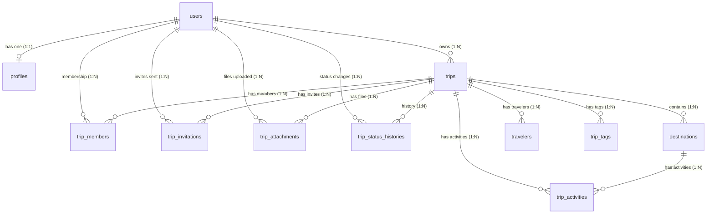

# VoyageAI Backend — Database Architecture (Sprint 3)

This document describes the updated schema models, enums, indexes, and relationship behaviors mapping our PostgreSQL database using Prisma ORM.

---

## 🗺️ Entity Relationship Layout

---

## 🗄️ Model Mappings

### 1. Trip Table (`trips`)
Holds core trip header data.
- `id` (UUID, Primary Key)
- `ownerId` (UUID, Foreign Key → `users.id`, Cascade Delete)
- `title` (String)
- `description` (String, Optional)
- `coverImage` (String, Optional)
- `startDate` (DateTime)
- `endDate` (DateTime)
- `status` (Enum: `TripStatus`, default: `PLANNING`)
- `visibility` (Enum: `TripVisibility`, default: `PRIVATE`)
- `currency` (String, default: "USD")
- `estimatedBudget` (Float, Optional)
- `actualBudget` (Float, Optional)
- `country` (String, Optional)
- `city` (String, Optional)
- `timezone` (String, default: "UTC")
- `isArchived` (Boolean, default: `false`)

### 2. Destination Table (`destinations`)
Holds stops along the trip itinerary.
- `id` (UUID, Primary Key)
- `tripId` (UUID, Foreign Key → `trips.id`, Cascade Delete)
- `name` (String)
- `latitude` (Float, Optional)
- `longitude` (Float, Optional)
- `country` (String, Optional)
- `city` (String, Optional)
- `arrivalDate` (DateTime, Optional)
- `departureDate` (DateTime, Optional)
- `notes` (String, Optional)
- `order` (Int) - Sequential order field.

### 3. Trip Member Table (`trip_members`)
Join table representing user access rights and roles for collaborations.
- `id` (UUID, Primary Key)
- `tripId` (UUID, Foreign Key → `trips.id`, Cascade Delete)
- `userId` (UUID, Foreign Key → `users.id`, Cascade Delete)
- `role` (Enum: `CollaboratorRole`, default: `VIEWER`)
- **Index**: Unique index `@@unique([tripId, userId])` prevents duplicate membership mappings.

### 4. Trip Invitation Table (`trip_invitations`)
Holds invitation details and secret tokens for collaborators.
- `id` (UUID, Primary Key)
- `tripId` (UUID, Foreign Key → `trips.id`, Cascade Delete)
- `inviterId` (UUID, Foreign Key → `users.id`, Cascade Delete)
- `inviteeEmail` (String)
- `role` (Enum: `CollaboratorRole`, default: `VIEWER`)
- `status` (Enum: `InvitationStatus`, default: `PENDING`)
- `token` (String, Unique)
- `expiresAt` (DateTime)

### 5. Trip Activity Table (`trip_activities`)
Specific itinerary events mapped inside trip destinations.
- `id` (UUID, Primary Key)
- `tripId` (UUID, Foreign Key → `trips.id`, Cascade Delete)
- `destinationId` (UUID, Foreign Key → `destinations.id`, Cascade Delete)
- `name` (String)
- `description` (String, Optional)
- `locationName` (String, Optional)
- `latitude` (Float, Optional)
- `longitude` (Float, Optional)
- `startTime` (DateTime, Optional)
- `endTime` (DateTime, Optional)
- `cost` (Float, Optional)
- `notes` (String, Optional)
- `order` (Int)

---

## 🔒 Referential Integrity & Deletion Strategy

- **Cascading Deletes**: 
  Deleting a `Trip` instantly cascades and deletes all associated `destinations`, `travelers`, `trip_members`, `trip_invitations`, `trip_attachments`, `trip_tags`, `trip_activities`, and `trip_status_histories`. This ensures our database stays clean without orphaned rows.
- **Cascade Deletes on User Wipes**:
  Deleting a `User` cascades to delete their owned `trips`, memberships, traveler profiles, and status auditing changes.
