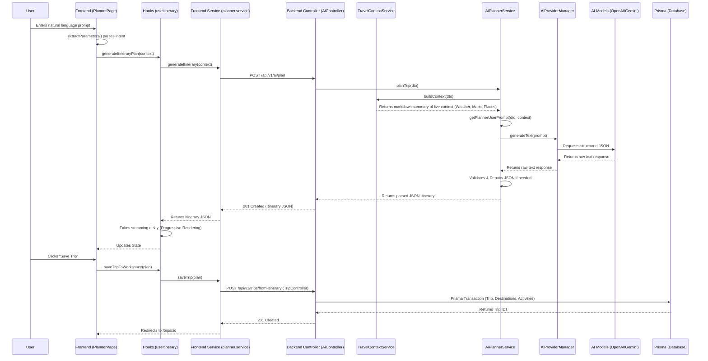

# VoyageAI Planner Architecture Audit
**Date:** July 2026
**Phase:** 1 - Discovery & Audit

This document audits the complete architecture of the VoyageAI Planner experience, detailing the flow from user input to trip persistence.

---

## Complete Request Flow Diagram

---

## Component Audit

### 1. Planner Page & NLP Parsing
1. **What currently happens?** `app/planner/page.tsx` uses basic Regex (`extractParameters`) to extract destination, dates, travelers, budget, and style from natural language. It updates local context.
2. **What should happen?** The NLP parsing could be offloaded to an AI intent parser if it gets too complex, but local parsing is fast for simple cases.
3. **What data is missing?** Detailed validation for dates (e.g., extracting exact dates rather than just "7 days").
4. **Which service owns it?** `usePlanner` / `useItinerary` hooks.
5. **Which API provides it?** N/A (Frontend logic).
6. **Which frontend component consumes it?** `PlannerSidebar`, `PromptInput`.
7. **Which backend endpoint provides it?** N/A.

### 2. Planner Hooks & Progressive Rendering
1. **What currently happens?** `useItinerary.ts` calls `planner.service.ts` to fetch the complete itinerary. Once received, it artificially simulates streaming by looping through the days with a fake `delay(800)` and updating the React state.
2. **What should happen?** True progressive rendering. The frontend should consume a Server-Sent Events (SSE) or WebSockets stream from the backend to render the itinerary as it is being generated by the LLM.
3. **What data is missing?** Real-time chunked data streams.
4. **Which service owns it?** `useItinerary.ts`.
5. **Which API provides it?** `aiService.planTrip`.
6. **Which frontend component consumes it?** `PlannerWorkspace`, `DayCard`.
7. **Which backend endpoint provides it?** `POST /api/v1/ai/plan`.

### 3. Backend Planner APIs
1. **What currently happens?** `AiController` exposes standard REST endpoints (`/plan`, `/regenerate`, `/optimize`, `/validate`) which delegate to `AiPlannerService`.
2. **What should happen?** Provide streaming capabilities for `/plan` so the frontend doesn't have to fake the typing effect.
3. **What data is missing?** Streaming infrastructure.
4. **Which service owns it?** `AiController`.
5. **Which API provides it?** Internal services.
6. **Which frontend component consumes it?** `ai.service.ts`.
7. **Which backend endpoint provides it?** `POST /api/v1/ai/plan`.

### 4. Live Travel Context Integration
1. **What currently happens?** `TravelContextService` aggregates data from Geocode, Weather, Timezone, Country, Holiday, and Places providers concurrently and compiles a markdown summary.
2. **What should happen?** Current flow is solid. Graceful degradation is in place if a provider fails.
3. **What data is missing?** Flight availability, Hotel availability, and actual prices instead of estimates.
4. **Which service owns it?** `TravelContextService`.
5. **Which API provides it?** OpenWeather, Google Maps, OpenTripMap, TimezoneDB, RestCountries, etc.
6. **Which frontend component consumes it?** N/A (Consumed by AI models).
7. **Which backend endpoint provides it?** Invoked internally during `POST /api/v1/ai/plan`.

### 5. AI Prompt Generation
1. **What currently happens?** `planner.prompts.ts` defines `PLANNER_SYSTEM_PROMPT` (rules, JSON schema) and `getPlannerUserPrompt` (interpolates user input and live context).
2. **What should happen?** Ensure token limits are respected if the context summary grows too large.
3. **What data is missing?** Dynamic token truncation for context.
4. **Which service owns it?** Prompt definitions.
5. **Which API provides it?** N/A.
6. **Which frontend component consumes it?** N/A.
7. **Which backend endpoint provides it?** Internal to `AiPlannerService`.

### 6. Images Integration
1. **What currently happens?** The frontend `app/planner/page.tsx` hardcodes a single mock Unsplash URL (`photo-1596422846543-75c6fc197f0a`) for all activities.
2. **What should happen?** An `ImagesService` must be built to fetch high-quality images from Unsplash or Wikimedia for the destination and specific activities, injecting them into the itinerary response.
3. **What data is missing?** Dynamic image URLs.
4. **Which service owns it?** `ImagesService` (Currently Not Started).
5. **Which API provides it?** Unsplash API.
6. **Which frontend component consumes it?** `DestinationCard`, `ActivityCard`, `DayCard`.
7. **Which backend endpoint provides it?** Missing. Should be part of the `Itinerary` JSON structure.

### 7. Trip Save Flow
1. **What currently happens?** `saveTripToWorkspace` calls `POST /api/v1/trips/from-itinerary`. `TripService` uses a Prisma transaction to parse the JSON and bulk-insert relational records (`Trip`, `TripMember`, `TripDestination`, `TripActivity`).
2. **What should happen?** Robust error handling and preservation of the generated images and exact context snapshots.
3. **What data is missing?** Persistent storage of generated images and related metadata.
4. **Which service owns it?** `TripService`.
5. **Which API provides it?** `POST /api/v1/trips/from-itinerary`.
6. **Which frontend component consumes it?** `SaveTripDialog`, `PlannerHeader`.
7. **Which backend endpoint provides it?** `POST /api/v1/trips/from-itinerary`.
