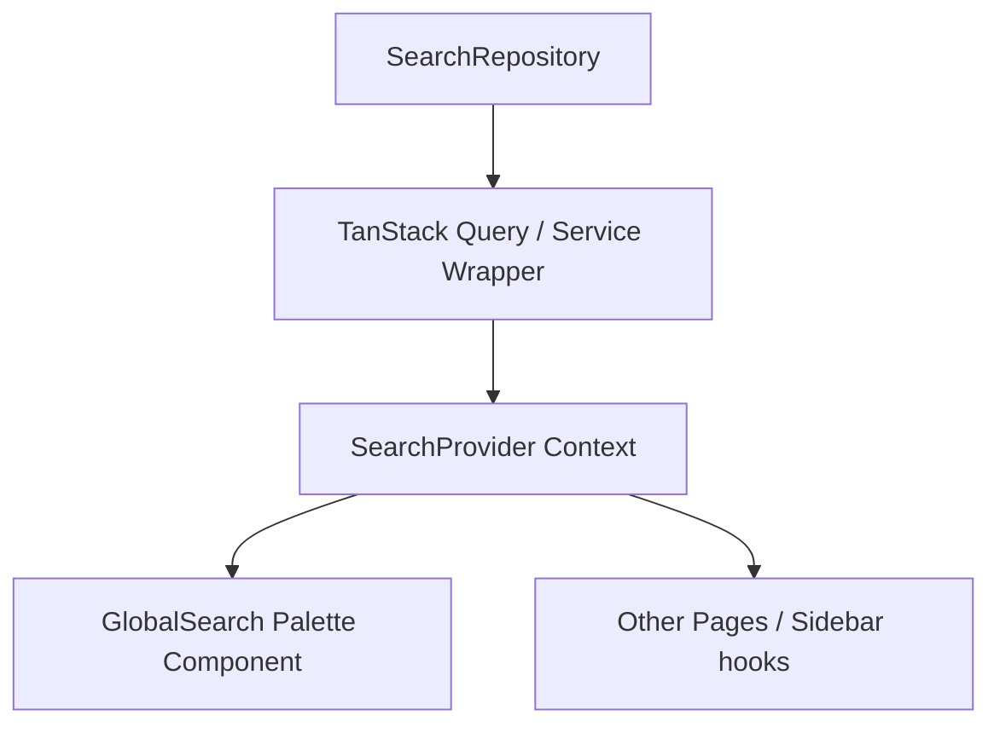

# Unified Search Architecture (101)

Details the system topology, data flow, and layers involved in the Unified Search Platform.

## Core Topology
The search platform is built as a single, decoupled service layer that can be consumed by any page, workspace, or sidebar in VoyageAI.

## Data Lifecycle
1. User interacts with query input inside `SearchInput`.
2. Input invokes `setQuery` inside `useSearch()` context.
3. Hook triggers debounced fetch matching current filters/categories.
4. results populate `results` state, resetting active keyboard focus index (`selectedIndex: 0`).
