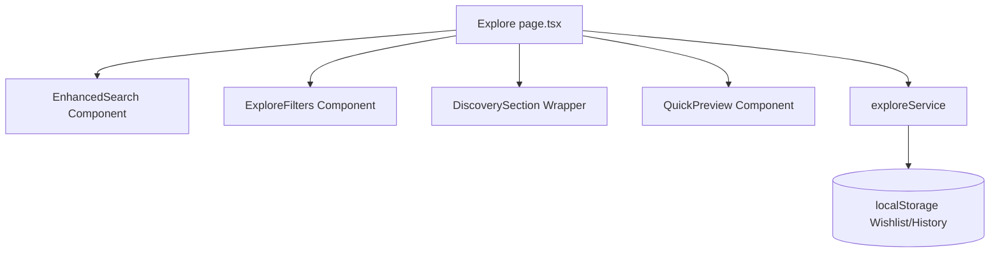

# Explore Architecture Blueprint (91)

This document maps out the system architecture of the Explore module, details state dependencies, and illustrates how data flows between repositories and the user interface.

## System Topology
The Explore module is fully encapsulated within the app router group `(app)/explore`. The layout integrates into the authenticated dashboard framework, relying on a unified state manager on the page level to coordinate multiple children elements (cards, filters, searches, slide-overs).

## State Architecture
- **FilterState**: Local React state variables on the route page coordinating categories, budgets, continental region criteria, best travel seasons, travel styles, and minimum ratings.
- **Wishlist state**: Client side `localStorage` storage mapping key-value identifiers: `wishlist-{id}: true`. Count is broadcasted via a global custom window event `wishlist-update` to update all items concurrently.
