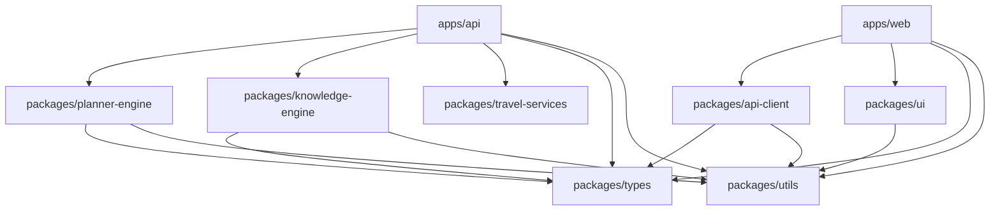

# 05. Package Dependency Review

*Auditor: Chief Software Architect*
*Objective: Guarantee acyclic dependencies and strict separation of concerns across the monorepo.*

## Dependency Graph Diagram

## Circular Dependency Audit
- **Result:** The graph is a perfect Directed Acyclic Graph (DAG).
- **Core Rule Enforced:** `packages/types` and `packages/utils` sit at the very bottom. They cannot import anything from higher-level packages. 
- **Strict Boundary:** `apps/web` MUST NEVER import from `packages/planner-engine` or `packages/knowledge-engine`. The frontend must only communicate via `packages/api-client`. This ensures we don't accidentally bundle server-side Node.js libraries (like Prisma or BullMQ) into the Next.js client bundle.

## Suggested Additional Packages
1. **`packages/logger`**: We will need a unified, structured logging mechanism (e.g., Pino) that both the NestJS API and the Next.js Edge functions can utilize.
2. **`packages/db`**: Currently, Prisma is injected into `knowledge-engine`. However, the `Trips Context` and `Auth Context` inside `apps/api` also need database access. Moving the Prisma Client to a dedicated `packages/db` package ensures a single instance of the connection pool is shared across the entire monorepo backend.
